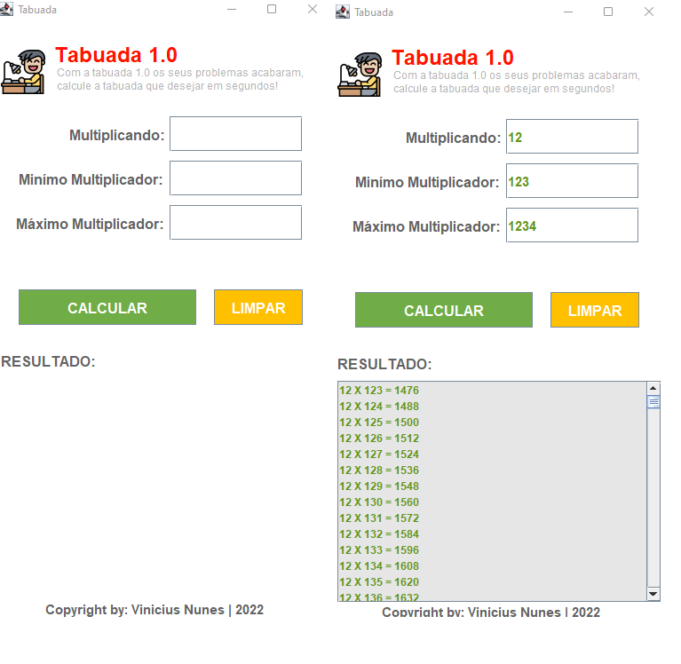

# <strong>TABUADA 1.0</strong>

## [clique aqui para baixar o executável](./executavel/TabuadaVinicius.jar)

## <strong>SOBRE</strong>

- Aplicação tipo Tabuada criada com o intuito de criar uma JLIST com base no mínimo e máximo multiplicando.
    
- - Foi proposto esse projeto pelo professor Fundamentos de Programação Orientada a Objetos com a finalidade de aplicarmos os conceitos aprendidos em aula na instituição [SENAI](https://jandira.sp.senai.br/).

---

## <strong>TECNOLOGIAS APLICADAS</strong>

- JAVA

---

## <strong>FERRAMENTAS</strong>

- ECLISE (IDE)
- GITHUB / GIT

---

## <strong>CONCEITOS APLICADOS</strong>

- GUI (Graphical User Interface)
- MODEL
- WHILE
- JLIST, JLABEL, JTEXT
- POP-UP DE ERROS (JOPTION PANE)

---

## <strong>AUTOR</strong>

- [VINICIUS NUNES](https://github.com/VINICIUSNUNES137)
